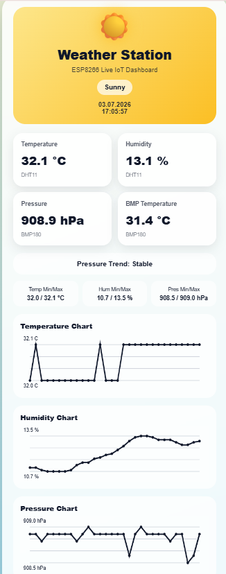
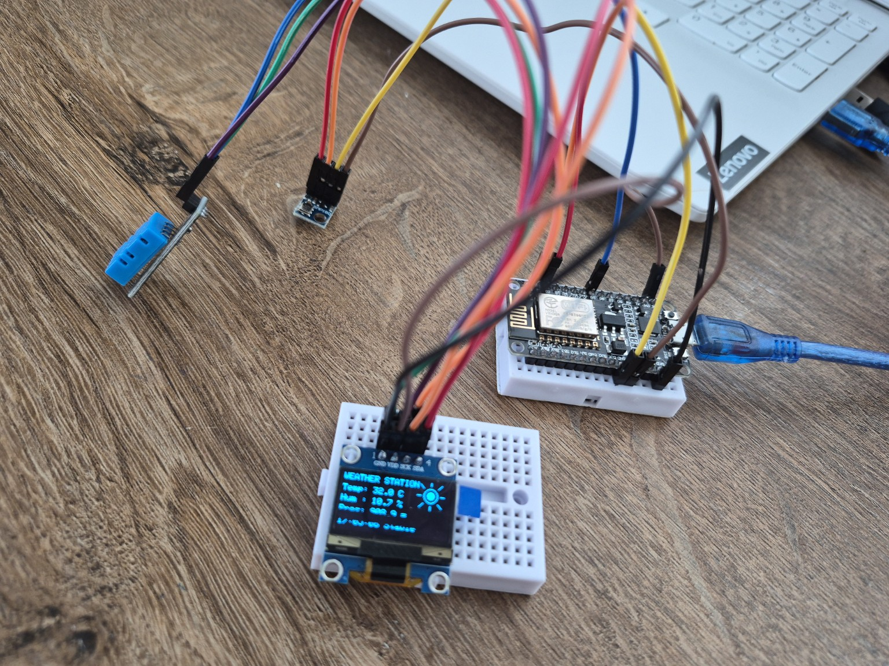

# ESP8266 Smart Weather Station with OLED Display and Live Web Dashboard

A compact IoT weather station built with an ESP8266 NodeMCU, an OLED display, a DHT11 temperature and humidity sensor, and a BMP180 pressure sensor. The device shows real-time sensor data on the OLED screen and serves a live web dashboard over Wi-Fi.

The web dashboard includes animated weather icons, day/night theme switching, live charts, min/max values, and a simple pressure trend algorithm.

## Project Preview

### Live Web Dashboard



### OLED Display Output


### Hardware Setup



## Features

- Real-time temperature and humidity measurement using DHT11
- Atmospheric pressure measurement using BMP180 / GY-68
- 128x64 SSD1306 OLED display over I2C
- Local web dashboard served directly by the ESP8266
- Live data endpoint at `/data`
- Animated dashboard icons and responsive mobile-friendly UI
- NTP-based date and time synchronization
- Pressure trend detection: Rising, Falling, Stable, or Collecting
- Last 30 readings stored in RAM for live charts
- Min/max values for temperature, humidity, and pressure
- Wi-Fi credentials isolated in `secrets.h`

## Hardware Used

| Component | Purpose |
|---|---|
| ESP8266 NodeMCU | Main controller and Wi-Fi web server |
| SSD1306 OLED 128x64 | Local display |
| DHT11 | Temperature and humidity sensor |
| BMP180 / GY-68 | Pressure and temperature sensor |
| Jumper wires | Connections |
| Breadboard | Prototyping |

## Wiring

### I2C Bus

OLED and BMP180 share the same I2C bus.

| Signal | ESP8266 NodeMCU | OLED | BMP180 / GY-68 |
|---|---|---|---|
| 3.3V | 3V3 | VDD | VIN |
| GND | GND | GND | GND |
| SCL | D1 / GPIO5 | SCK / SCL | SCL |
| SDA | D2 / GPIO4 | SDA | SDA |

### DHT11

| DHT11 Pin | ESP8266 NodeMCU |
|---|---|
| VCC / + | 3V3 |
| GND / - | GND |
| DATA / S / OUT | D5 / GPIO14 |

## Software Requirements

Install these libraries in Arduino IDE:

- ESP8266 board package by ESP8266 Community
- Adafruit SSD1306
- Adafruit GFX Library
- Adafruit BMP085 Library
- DHT sensor library by Adafruit
- Adafruit BusIO, if requested as a dependency

## Setup

1. Open `firmware/weather_station/weather_station.ino` in Arduino IDE.
2. Copy `secrets.example.h` as `secrets.h`.
3. Edit `secrets.h` and add your Wi-Fi credentials:

```cpp
const char* WIFI_SSID = "YOUR_WIFI_NAME";
const char* WIFI_PASSWORD = "YOUR_WIFI_PASSWORD";
```

4. Select the board:

```text
NodeMCU 1.0 (ESP-12E Module)
```

5. Select the correct COM port.
6. Upload the firmware.
7. Open Serial Monitor at `115200 baud`.
8. Copy the printed IP address.
9. Open the dashboard in a browser:

```text
http://YOUR_ESP8266_IP
```

## Web Endpoints

| Endpoint | Description |
|---|---|
| `/` | Main live web dashboard |
| `/data` | JSON sensor data endpoint |

Example `/data` output:

```json
{
  "dhtOk": true,
  "dhtTemp": 31.8,
  "humidity": 45.2,
  "bmpTemp": 30.9,
  "pressure": 907.6,
  "label": "Partly Cloudy",
  "trend": "Stable",
  "time": "18:05:58"
}
```

## Pressure Trend Logic

The system compares the latest pressure reading with the oldest value in the current history buffer.

| Condition | Trend |
|---|---|
| Difference greater than +0.5 hPa | Rising |
| Difference lower than -0.5 hPa | Falling |
| Otherwise | Stable |
| Fewer than 6 readings | Collecting |

This is a simple short-term trend indicator, not a full meteorological forecast model.

## Notes and Limitations

- DHT11 has limited accuracy and slow response. For better performance, DHT22, SHT31, or BME280 can be used.
- BMP180 provides pressure and temperature, but humidity is provided by DHT11.
- Sensor readings may be higher when the sensors are placed very close to the ESP8266 because the Wi-Fi module produces heat.
- The history buffer is stored in RAM and resets after power loss.
- The dashboard is hosted locally. The device and browser must be on the same Wi-Fi network.

## Possible Future Improvements

- Replace DHT11 + BMP180 with BME280 or BME680
- Add data logging to EEPROM, SD card, or cloud storage
- Add MQTT support
- Add PlatformIO project structure
- Add a 3D printed enclosure
- Add USB power consumption measurements
- Add calibration offset settings

## Project Status

Working prototype.

## License

This project is released under the MIT License.
